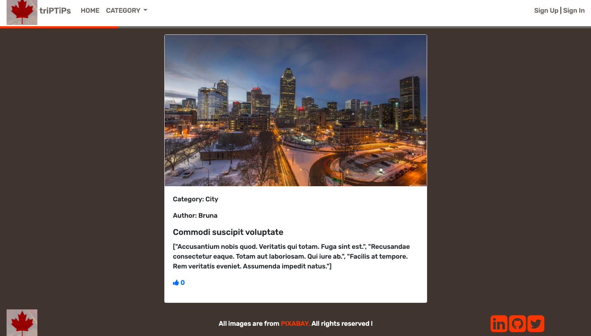

# TRIP TIPS

> This is a Desktop version of a blog where the user can create articles to share informations about traveling in Canada.

## Features
- Registration & Login;
- Ability to create categories;
- Ability to create articles that belong to multiple categories and contain images;
- Ability to vote articles.




## Built With

- Ruby v2.6.5
- Ruby on Rails v5.2.4.3
- VSCode
- Bootstrap 4
- Rubocop
- Stylelint
- Bullet
- Devise
- Rspec / Capybara
- Heroku App

## Live Demo

- Heroku App

You can click on this [link](https://trip-tips-canada.herokuapp.com)


## Getting Started


### Prerequisites

- Ruby: 2.6.5

- Rails: 5.2.4.3

To get started open the directory where you will save this repo by typing on your terminal:

```
$ cd <directory>
```

- Clone the repo typing:

```
$ git clone git@github.com:brugobi/RoR--Capstone.git
```

- Install the needed gems:

```
$ bundle install --without production
```

- Setup database:

```
$ rails db:create 
````
```
$ rails db:migrate
```


### Usage


Start the server:

```
$ rails server
```

Open `http://localhost:3000/` in your browser.


### Run tests

```
$ rspec --format documentation
```

## Author

👤 **Bruna Gobi**

- Github: [@brugobi](https://github.com/brugobi)
- Twitter: [@BrunaGobi2](https://twitter.com/BrunaGobi2)
- Linkedin: [bruna-gobi](https://www.linkedin.com/in/bruna-gobi/)

## 🤝 Contributing

Contributions, issues and feature requests are welcome!

## Show your support

Give a ⭐️ if you like this project!
Feel free to check the [issues page](issues/).

## Acknowledgments

- Project requested by [Microverse Program](https://www.microverse.org/).
- The project design and original idea are from [Nelson Sakwa](https://www.behance.net/sakwadesignstudio). You can find the complete project on [this Behance link](https://www.behance.net/gallery/14554909/liFEsTlye-Mobile-version).
- All the images were taken from [Pixabay](https://pixabay.com/pt/).

## 📝 License

This project is [MIT](lic.url) licensed.
